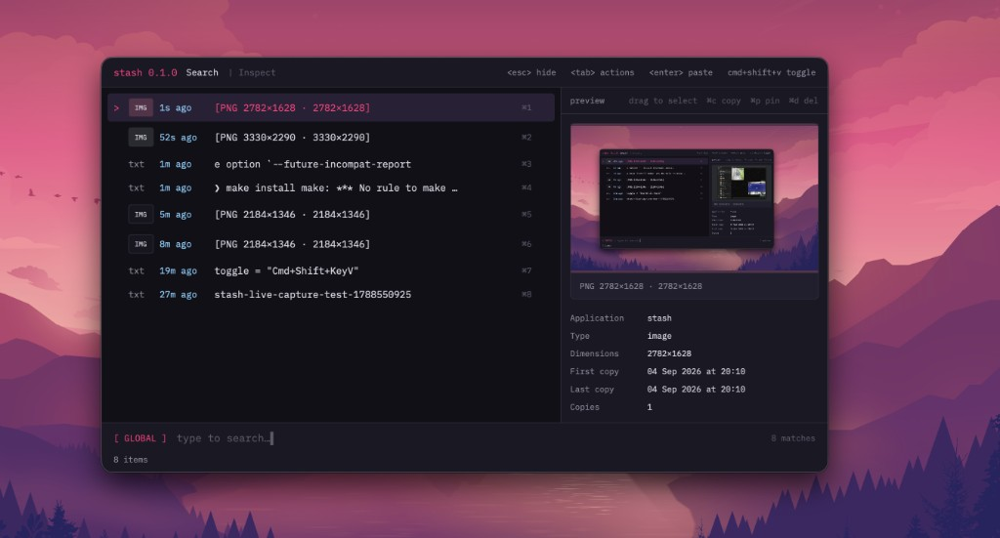

<div align="center">
  <h1>copy-pasta</h1>

  <p><strong>Atuin for your clipboard — instant, searchable, context-aware paste history.</strong></p>

  <p>
    
    
    
  </p>

  <p>
    <a href="#install">Install</a>
    &nbsp;·&nbsp;
    <a href="#quickstart">Quickstart</a>
    &nbsp;·&nbsp;
    <a href="#config">Config</a>
  </p>

  <p>
    
  </p>
</div>

---

Keyboard-first clipboard history for macOS. Runs in the background, captures text and images, and pops up on a global hotkey so you can search and re-copy without breaking flow. Copied URLs show a website preview (Open Graph image, or a screenshot fallback) in the right-hand pane.

<a id="install"></a>
## Install

Requires [Rust](https://rustup.rs) **1.85+** and `~/.cargo/bin` on your `PATH`.

```bash
git clone https://github.com/cesarferreira/copy-pasta.git
cd copy-pasta
make install-release
```

Debug install (faster compile):

```bash
make install
```

Run without installing:

```bash
make run
# or
make build-release && ./target/release/copy-pasta
```

<a id="quickstart"></a>
## Quickstart

```bash
copy-pasta
```

copy-pasta runs as a **background agent** (no Dock icon). After `make install` / `make install-release`, the first launch installs a LaunchAgent so it starts again at login.

| Action | How |
|--------|-----|
| Show / hide popup | Global hotkey (default `cmd+shift+v`) |
| Hide | `esc` |
| Quit | `cmd+q` (LaunchAgent restarts only after a crash, not a clean quit) |

In the popup: ↑↓ to move, `enter` to paste into the previous app, `tab` for actions, `cmd+e` edit, `cmd+p` pin, `cmd+d` delete.

Search with `#tags` (AND): `#img`, `#txt`, `#json`, `#shell`, `#pin`, … — combine with text, e.g. `#json token`.

Paste-back needs **Accessibility** permission for copy-pasta (System Settings → Privacy & Security → Accessibility) so it can send ⌘V.

<a id="config"></a>
## Config

On first launch, copy-pasta writes `~/.config/copy-pasta/copy-pasta.toml`:

```toml
[hotkey]
toggle = "cmd+shift+v"

[agent]
launch_at_login = true
```

Change `toggle` to a lowercase chord (`cmd+shift+v`, `ctrl+alt+s`, …), then restart. Set `launch_at_login = false` to remove the LaunchAgent.

History lives at:

`~/Library/Application Support/dev.copy-pasta.copy-pasta/clipboard.sqlite`

## License

MIT
